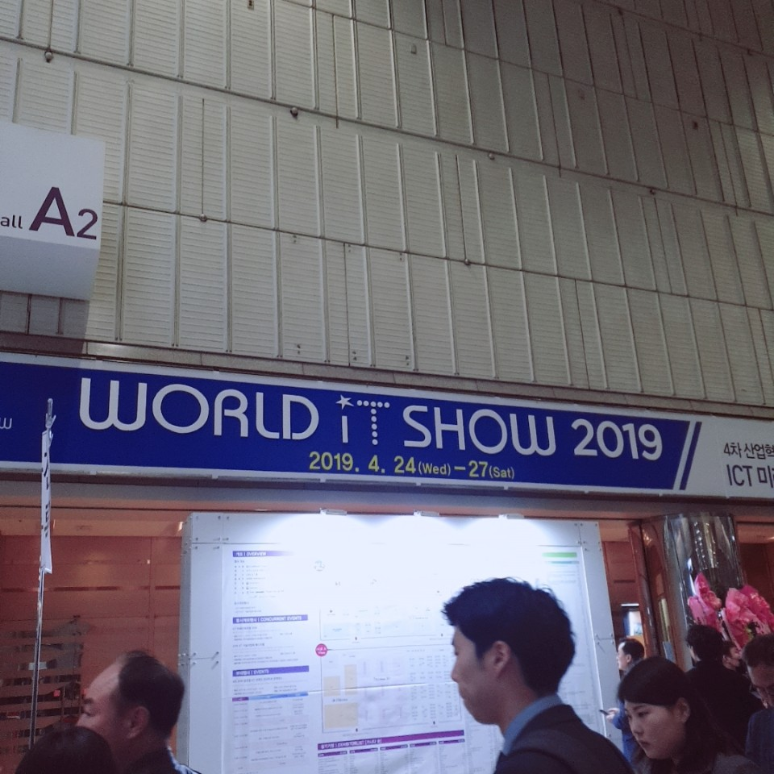

## World IT show

4월 26일 코엑스에서 개최된 world it show에 방문하게 되었다

전시장 1층에는 소규모 부스들이 많았는데, 요즘 트랜드인 영상인식이나 딥러닝, 드론을 이용한 시제품들이 많이 보였다.

또한 ICT 명품 인재 양성 코너가 있었는데, 대학에서 개발한 제품과 기술을 전시 해 놨는데, 그곳에서 국민대도 만날 수 있었다. 

개인적으로 가장 흥미로웠던 제품은 공중 메모펜 : Toward Memorizer with on-chip learning이었다. 

갑자기 생각난 것을 기록해야 할때 생각보다 메모 방법들이 접근성이 떨어진다는 것에서 부터 시작된 아이디어였다. 

IMU를 접목한 방식이었다고 했는데, 처음 들어보는 생소한 기술이어서 흥미로웠다. 

이 제품은 드론을 펜에 접목한 방식이었는데 

드론에서 IMU를 이요해서 본체의 회전상태를 파악하고 드론의 형체대신 볼펜의 형체를 적용시키면, 

볼펜의 회전상태를 파악하여 어떤 글자 혹은 그림을 그렸는지 알수 있는 형식이었다. 

흔적을 남길 때 볼펜의 끝 부분만 지정하여 남긴다면, 글자 혹은 그림만 나타나게 된다. 

IMU라는 방식도 생소하고 드론과 펜을 접목한 생소한 조합에 제일 관심가는 제품이었다.

2층에는 주로 대기업의 제품들이 있었는데 카카오, 현대, SK, KT 등이 있었다. 

카카오나 현대 같은 경우 스마트카나 자율주행 차를 선보이고 있었고, 

SK나 KT같은 회사에서 5G 기술을 선보이고 있었다. 

5G같은 경우 TV에서도 4차산업의 기술로 독보이고 있었는데, 

개인적으로는 현재 사용하고 있는 4G와 어떤 차이가 있는지 체감이 되지 않았다. 

하지만 world it show의 부스를 체험하면서 어떻게 변화 할 수 있는지 확인할 수 있게 되었다. 

가장 흥미로운 부스는 KT의 5G 부스였다. 평소에 야구에 관심이 많았는데, 야구를 다각도에서 볼 수 있다는 점을 어필 하고 있었다.  

야구를 체험해 보는 체험부스도 있었는데, 사람이 많아 체험해 보지 못해 아쉬웠다. 

최신 it 기술이 어떻게 진행되고 있는지 어떤 기술이 제일 많이 사용되고 있는지 전체적으로 알 수 있는 전시여서 굉장히 유의미하고 재밌는 전시였다. 

기회가 된다면 내년에도 참가 하고 싶은 생각이 들었다. 

